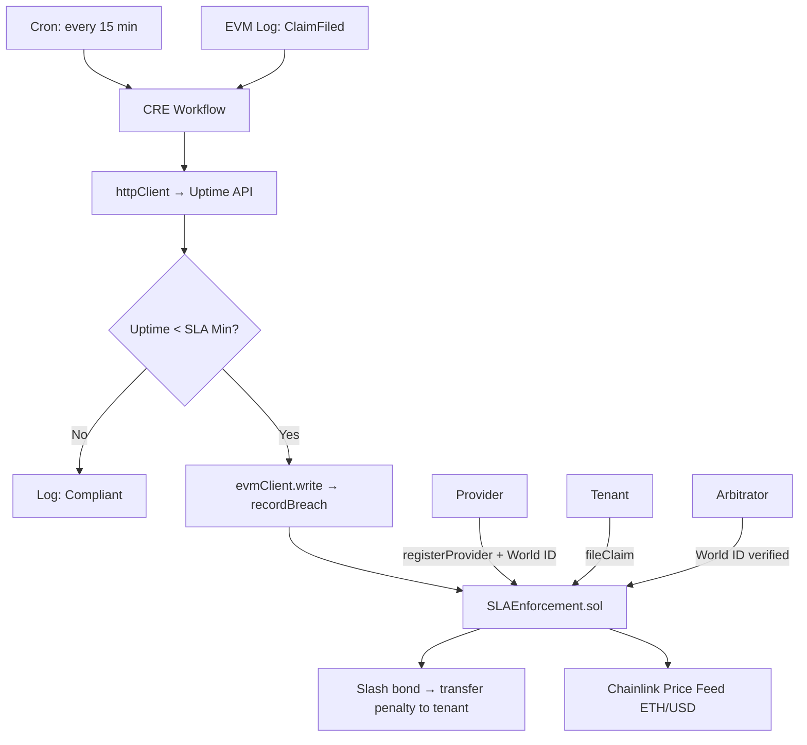

# OathKeeper

On-chain SLA enforcement for tokenized real-world assets. If a property manager misses maintenance deadlines or uptime thresholds, Chainlink CRE auto-detects the breach and triggers penalty payments from their bonded collateral. World ID ensures only verified humans can be SLA providers or arbitrators.

**Hackathon:** CONVERGENCE (Chainlink) — Deadline: March 8, 2026
**Prize Target:** $16K (Risk & Compliance) + $5K (World ID) + $5K (Tenderly) = $26K

---

## Architecture



## How Chainlink CRE is Used

- **Cron trigger** — scans all active SLAs every 15 minutes for compliance
- **EVM Log trigger** — reacts immediately when a `ClaimFiled` event fires
- **httpClient** — fetches off-chain uptime metrics from the provider API
- **evmClient.read** — reads active SLA terms from the contract
- **evmClient.write** — calls `recordBreach()` to slash the bond automatically

## How World ID is Used

- **Provider registration** — Orb-level verification prevents Sybil SLA providers from farming dispute outcomes
- **Arbitrator access** — only human-verified arbitrators can uphold or overturn CRE-detected breaches

## How Tenderly is Used

- **Virtual TestNet** — Sepolia mainnet fork with unlimited faucet for deployment
- **Public explorer** — judges can verify all transactions without a wallet
- **Gas profiler** — optimize contract execution costs

---

## Project Structure

```
oathkeeper/
├── contracts/          # Foundry smart contracts
│   ├── src/
│   │   └── SLAEnforcement.sol
│   ├── script/
│   │   └── DeploySLA.s.sol
│   └── test/
│       └── SLAEnforcement.t.sol
├── workflow/           # Chainlink CRE workflow
│   ├── workflow.ts
│   └── mock-api/
│       └── server.ts
└── dashboard/          # Next.js 14 frontend
    └── src/app/
        ├── page.tsx                    # Dashboard overview
        ├── provider/register/page.tsx  # World ID + bond ETH
        ├── sla/create/page.tsx         # Create SLA
        ├── claims/page.tsx             # File claims
        └── arbitrate/page.tsx          # World ID gated arbitration
```

---

## Setup

### Contracts

```bash
cd contracts
forge install
forge build
forge test
```

Deploy to Tenderly Virtual TestNet:

```bash
forge script script/DeploySLA.s.sol \
  --rpc-url $TENDERLY_RPC_URL \
  --broadcast \
  --verify
```

### CRE Workflow

```bash
cd workflow
npm install
```

Set environment variables:
```bash
SLA_CONTRACT_ADDRESS=0x...   # from Tenderly deployment
UPTIME_API_URL=http://localhost:3001
```

Simulate:
```bash
cre workflow simulate --verbose --broadcast
```

### Mock Uptime API

```bash
cd workflow/mock-api
npm install
npm run dev

# Trigger a breach (set uptime below 99.5%)
curl -X POST http://localhost:3001/set-uptime \
  -H "Content-Type: application/json" \
  -d '{"uptime": 98.0}'
```

### Dashboard

```bash
cd dashboard
npm install
cp .env.local.example .env.local
# Set NEXT_PUBLIC_SLA_CONTRACT_ADDRESS and NEXT_PUBLIC_WLD_APP_ID
npm run dev
```

---

## Demo Script

1. Show dashboard with 2 active SLAs, compliance charts
2. Register provider via World ID → bond 1 ETH collateral
3. Tenant files claim: "Plumbing issue in unit 4B"
4. Trigger breach: `POST /set-uptime {"uptime": 98.0}` (below 99.5% threshold)
5. CRE detects on next scan → calls `recordBreach()` automatically
6. Dashboard updates: bond reduced by 5%, 0.05 ETH transferred to tenant
7. Arbitrator (World ID verified) reviews and upholds the breach
8. Show Tenderly explorer: all transactions publicly verifiable

---

## Smart Contract

### SLAEnforcement.sol

| Function | Description |
|---|---|
| `registerProvider(nullifierHash)` | Bond ETH + store World ID nullifier |
| `createSLA(tenant, responseTimeHrs, minUptimeBps, penaltyBps)` | Create SLA with bonded collateral |
| `fileClaim(slaId, description)` | Tenant submits maintenance request |
| `recordBreach(slaId, uptimeBps, penaltyBps)` | CRE calls this to slash bond + pay tenant |
| `arbitrate(slaId, upheld)` | World ID verified override |
| `getCollateralRatio(slaId)` | ETH/USD valuation via Chainlink price feed |

### Events Indexed by CRE

- `SLACreated(slaId, provider, tenant)`
- `ClaimFiled(claimId, slaId, tenant)` — triggers reactive CRE workflow
- `SLABreached(slaId, provider, uptimeBps, penaltyAmount)`
- `ArbitrationDecision(slaId, arbitrator, upheld)`

---

## Tech Stack

| Layer | Technology |
|---|---|
| Contracts | Foundry (Solidity ^0.8.20) |
| Automation | Chainlink CRE SDK (TypeScript) |
| Price Feeds | Chainlink AggregatorV3Interface (ETH/USD) |
| Identity | World ID / IDKit v1 |
| Testing | Tenderly Virtual TestNets |
| Frontend | Next.js 14 + Tailwind + Framer Motion |
| Charts | Recharts |
